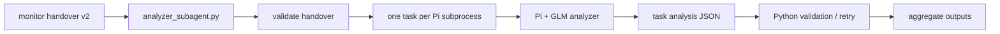

## Harbor Analyzer MVP

Analyzer is an optional post-monitor component. It does not run during the
normal Harbor benchmark path unless `scripts/analyzer_subagent.py` is invoked.

Its job is limited to root-cause analysis and classification:

- classify each handover task as `success`, `env_fail`, `infra_fail`,
  `model_fail`, or `unknown`;
- preserve the evidence used for the classification;
- write benchmark-level and env/infra-only summaries.

It must not repair files, restart services, stop benchmark runs, or decide how
to fix a task.

### Runtime flow

Python owns orchestration:

- CLI argument parsing and follow-mode state;
- per-task Pi subprocess launch;
- path-gated read-only tool setup;
- output parsing, schema validation, retry, and fallback;
- final artifact assembly.

Pi + GLM owns semantic analysis:

- read only the handover and task-related artifacts allowed by Python;
- inspect logs/results for the single assigned task;
- return exactly one task analysis JSON object.

### Safety boundaries

Analyzer Pi is launched as an isolated subprocess with:

- a minimal environment;
- `HARBOR_ANALYZER_API_KEY` instead of the general `API_KEY`;
- a read-only tool allowlist: `read`, `grep`, `find`, `ls`;
- a path-gate extension limiting file access to the handover, run/queue dirs,
  the task result path, and task artifact directory;
- tool-audit JSONL used to validate evidence references;
- best-effort secret redaction for tool output.

The path gate is defense-in-depth; the analyzer prompt is not treated as a
security boundary.

### Retry policy

Each task currently gets at most two Pi attempts.

Retryable harness failures:

- `pi_dispatch_timeout`;
- `pi_provider_request_failed:*`;
- `pi_final_message_truncated`;
- `pi_final_message_invalid_json`;
- task JSON validation failures.

If all attempts fail, the task is reported as:

- `analysis_status = analysis_failed`;
- `final_class = unknown`;
- `root_cause_code = insufficient_or_conflicting_evidence`;
- `recommended_events = ["notify_user"]`.

### Output files

Analyzer writes immutable snapshot files keyed by `handover_id` and
`publication_id`, then atomically updates one latest manifest pointer under a
cross-process lock. Readers should load the manifest first, then read the
snapshot paths named inside it.

| latest manifest | snapshot path | contents |
|---|---|---|
| `analyzer-artifacts-latest.json` `artifacts.benchmark_report_path` | `analyzer-runs/<handover_id>/<publication_id>.json` | benchmark-level report containing every task analysis |
| `analyzer-artifacts-latest.json` `artifacts.env_infra_tasks_path` | `env-infra-tasks/<handover_id>/<publication_id>.json` | only tasks classified as `env_fail` or `infra_fail` |
| `analyzer-artifacts-latest.json` `artifacts.fix_line_index_path` | `fix-line-index/<handover_id>/<publication_id>.jsonl` | legacy-named evidence index; each row points to lines used by the analyzer |

`fix-line-index` is a historical artifact name. Its rows are root-cause
evidence references, not repair instructions.

### Task analysis schema

Each `tasks[]` entry in `analyzer-runs/<handover_id>/<publication_id>.json`
contains:

| field | meaning |
|---|---|
| `task` | exact task identity from the handover |
| `analysis_status` | `analysis_complete` or `analysis_failed` |
| `final_class` | `success`, `env_fail`, `infra_fail`, `model_fail`, or `unknown` |
| `failure_stage` | stage such as `environment_setup`, `agent_execution`, `verifier`, or `none` |
| `root_cause_code` | canonical code, `unmapped_*`, or `insufficient_or_conflicting_evidence` |
| `root_cause_summary` | concise human-readable root-cause summary |
| `scope` | `task`, `benchmark`, or `host` |
| `confidence` | number from `0` to `1` |
| `observations` | important facts found while analyzing |
| `reasoning_summary` | concise explanation connecting evidence to classification |
| `alternatives_considered` | other causes considered and rejected |
| `recommended_events` | always `["notify_user"]` |
| `fix_references` | legacy-named evidence references used for env/infra classifications |

Analyzer strips `fix_goal` and `recommended_actions` if a model returns them.

### Env/infra task list

`env-infra-tasks/<handover_id>/<publication_id>.json` is derived from the
report. It includes only:

- `task`;
- `final_class`;
- `failure_stage`;
- `root_cause_code`;
- `root_cause_summary`;
- `scope`;
- `confidence`;
- `source_report_path`;
- `fix_line_index_path`.

It intentionally does not include repair plans.

### Evidence index rows

Each `fix-line-index/<handover_id>/<publication_id>.jsonl` row contains:

- task identity;
- `root_cause_code`;
- evidence file `path`;
- `line_start` / `line_end`;
- `fact`;
- `reason`;
- pointers back to the full analyzer report and per-task JSON.
