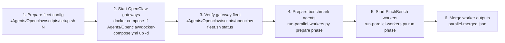

# PinchBench

PinchBench is an agent benchmark suite that submits tasks to an OpenClaw gateway and measures how well the assistant completes them. Each task is sent as a conversation turn to the gateway; the gateway invokes tools, calls the configured model, and returns a response that PinchBench records as the task result.

Run [PinchBench](https://github.com/pinchbench/skill) in parallel across multiple Dockerized [OpenClaw](https://openclaw.ai/) gateway instances. This repository does that by sharding tasks across multiple OpenClaw gateway instances and merging the worker outputs into one result bundle.

## Architecture

Each PinchBench worker runs in its own Docker container and shares the matching OpenClaw gateway's config/state directory, workspace directory, and network namespace.

```
┌─────────────────────── Host (macOS / Linux) ───────────────────────┐
│                                                                    │
│  ┌─────────────────┐  ┌─────────────────┐       ┌─────────────────┐│
│  │   openclaw-1    │  │   openclaw-2    │  ...  │   openclaw-N    ││
│  │   (gateway)     │  │   (gateway)     │       │   (gateway)     ││
│  └────────┬────────┘  └────────┬────────┘       └────────┬────────┘│
│           │                    │                         │         │
│  ┌────────┴────────┐  ┌────────┴────────┐       ┌────────┴────────┐│
│  │   worker-1      │  │   worker-2      │  ...  │   worker-N      ││
│  │   (pinchbench)  │  │   (pinchbench)  │       │   (pinchbench)  ││
│  │                 │  │                 │       │                 ││
│  │  shared config  │  │  shared config  │       │  shared config  ││
│  │  shared workspace│ │  shared workspace│      │  shared workspace││
│  │  shared network │  │  shared network │       │  shared network ││
│  └─────────────────┘  └─────────────────┘       └─────────────────┘│
│                                                                    │
│  .pinchbench-results-docker/<timestamp>/                           │
│    ├── worker-1/prepare.log                                        │
│    ├── worker-1/run.log                                            │
│    ├── worker-2/prepare.log                                        │
│    ├── worker-2/run.log                                            │
│    ├── worker-N/prepare.log                                        │
│    ├── worker-N/run.log                                            │
│    └── parallel-merged.json                                        │
└────────────────────────────────────────────────────────────────────┘
```

## Workflow



> **Worker-to-gateway mapping:** Each PinchBench worker runs `benchmark.py` for its assigned task IDs and submits those requests only to its associated OpenClaw gateway, reusing that gateway's token, config, workspace, and network namespace.

## Prerequisites

- **Docker Engine + Docker Compose v2** — [Install Docker Engine](https://docs.docker.com/engine/install/) or [Docker Desktop](https://www.docker.com/products/docker-desktop/)
- **A running OpenClaw fleet** — see [`Agents/Openclaw/README.md`](../../Agents/Openclaw/README.md) for setup
- **`python3`** — pre-installed on macOS; used for task selection and result merging
- **`git`** — used to clone PinchBench if not already present

## Quick Start

```bash
# 1. Set up and launch the OpenClaw fleet (3 instances)
BASE_URL="https://your-openai-compatible-endpoint/v1" \
API_KEY="$PROVIDER_API_KEY" \
MODEL="your-model-id" \
./Agents/Openclaw/scripts/setup.sh 3

# To enable tracing OpenClaw to Opik, build the opik-enabled image first
# and pass the Opik config at setup (OPIK_URL and OPIK_PROJECT_NAME required):
#   OPIK_PLUGIN=enabled ./Agents/Openclaw/scripts/build-openclaw-image.sh
#
#   OPIK_PLUGIN=enabled \
#   OPIK_URL="https://opik.example.com/api/" \
#   OPIK_PROJECT_NAME="my-project" \
#   BASE_URL="https://your-openai-compatible-endpoint/v1" \
#   API_KEY="$PROVIDER_API_KEY" \
#   MODEL="your-model-id" \
#   ./Agents/Openclaw/scripts/setup.sh 3

docker compose -f Agents/Openclaw/docker-compose.yml up -d
./Agents/Openclaw/scripts/openclaw-fleet.sh status

# 2. Configure benchmark defaults
# Usually only MODEL is required here.
# For local OpenAI-compatible providers, also set PINCHBENCH_MODEL_PROVIDER.
$EDITOR Tasks/Pinchbench/config/pinchbench.env

# 3. Run PinchBench in parallel (one worker per gateway)
API_KEY="$PROVIDER_API_KEY" ./Tasks/Pinchbench/scripts/run-parallel-workers.py --instances 3

# Run multiple iterations and generate per-iteration summaries
API_KEY="$PROVIDER_API_KEY" ./Tasks/Pinchbench/scripts/run-parallel-workers.py --instances 3 -n 5
```

The default flow works with the local OpenAI-compatible provider that your OpenClaw fleet is configured to use.
Benchmark-specific defaults live in [`Tasks/Pinchbench/config/pinchbench.env`](./config/pinchbench.env).
The PinchBench repo is cloned automatically to `/tmp/pinchbench-skill` on first run. Override `PINCHBENCH_DIR` in `pinchbench.env` if you want a different checkout path.
If you point `PINCHBENCH_DIR` at an existing checkout, it must be clean; the runner will refuse to reuse a checkout with local edits or untracked files.
The runner checks out pinned upstream commit `f3f1cb560c252541cef6a106c05ba4f2e8068be0` and applies local patches from [`Tasks/Pinchbench/patches/`](./patches/) so the workflow is self-contained. The current patch stack adds `--model-provider` support for local OpenAI-compatible backends and a prepare phase that creates or rewrites benchmark agents before task execution starts.

### Sanity Check

Start with a single task on one worker to verify the setup:

```bash
API_KEY="$PROVIDER_API_KEY" ./Tasks/Pinchbench/scripts/run-parallel-workers.py \
  --instances 1 \
  --suite task_sanity
```

### Local Provider Example

Use this example when the OpenClaw gateways should call a local OpenAI-compatible endpoint such as vLLM or SGLang.

> **Note:** `BASE_URL` is the API root; the runner appends `/v1` automatically (e.g. `http://host.docker.internal:8000` becomes `http://host.docker.internal:8000/v1`). A URL that already ends in `/v1` is accepted unchanged.

```bash
BASE_URL="http://host.docker.internal:8000/v1" \
API_KEY="dummy" \
MODEL="local-model-id" \
./Agents/Openclaw/scripts/setup.sh 1

docker compose -f Agents/Openclaw/docker-compose.yml up -d

# Then set these in Tasks/Pinchbench/config/pinchbench.env:
# MODEL=local-model-id
# PINCHBENCH_MODEL_PROVIDER=vllm

./Tasks/Pinchbench/scripts/run-parallel-workers.py --instances 1 --suite task_sanity
```

## Files

```
Tasks/Pinchbench/
├── config/
│   └── pinchbench.env             # Benchmark-specific defaults for the runner
├── Dockerfile                     # Worker image (Node.js + Python + uv + openclaw CLI)
├── patches/
│   ├── 0001-local-provider-support.patch  # Adds --model-provider support and skips remote catalog validation for local OpenAI-compatible backends
│   └── 0002-precreate-benchmark-agents.patch  # Precreates benchmark agents and fails instead of falling back during task runs
├── scripts/
│   ├── run-parallel-workers.py    # Worker launcher: prepare agents, shard tasks, run workers, merge results
│   └── summary.py                 # CLI summary printer for parallel-merged.json
└── README.md
```

## How It Works

The runner script does six things:

1. **Validate** — checks Docker, fleet env, and instance count
2. **Sync** — clones PinchBench, checks out the pinned upstream ref, and applies local patches
3. **Build** — builds the worker Docker image if needed
4. **Shard** — expands the suite into task IDs, distributes round-robin across workers
5. **Prepare + Run** — prepares one benchmark agent per OpenClaw instance, then starts the worker container for the assigned task shard
6. **Merge** — waits for all workers and merges their JSON outputs

Each worker container mounts and reuses the matching OpenClaw gateway state:

| Docker flag | Purpose |
|---|---|
| `--network container:openclaw-N` | Send the worker's benchmark traffic through gateway `N` |
| `-v config_dir:/home/node/openclaw-state` | Mount gateway `N`'s OpenClaw config/state directory without overlaying `/home/node/.openclaw` |
| `-v workspace_dir:/home/node/workspace` | Mount gateway `N`'s OpenClaw workspace directory outside the config home |
| `-v worker_dir:/runner` | Provide a worker-local scratch directory for the run |
| `-e OPENCLAW_GATEWAY_TOKEN` | Authenticate the worker to gateway `N` |

Without these mounts and the gateway token, the worker would run against different config/workspace state and would not see the same conversations or files created through that gateway.

## Configuration

The runner reads defaults from [`config/pinchbench.env`](./config/pinchbench.env), shared infrastructure (`BASE_URL`, `API_KEY`, `MODEL`, package mirrors) from the repo-root `config.env` (with private overrides/secrets in the git-ignored `config.local.env`), and fleet-wide values (`COUNT`, `CONFIG_BASE`, `WORKSPACE_BASE`) from `Agents/Openclaw/config/fleet.env`. Environment variables override all of these. Relative paths in `pinchbench.env` are resolved from the repository root.

`MODEL` is required in `pinchbench.env` only when it is not already set in the root config. `PINCHBENCH_MODEL_PROVIDER` is required only when the fleet uses a local OpenAI-compatible backend and auto-detection is insufficient (typical values: `vllm`, `sglang`, `openai-compatible`). Everything else is optional.

| Variable | Default | Description |
|---|---|---|
| `COUNT` | `4` | Number of instances when `--instances` is omitted |
| `MODEL` | _(none)_ | Required unless already provided elsewhere in the environment stack |
| `PINCHBENCH_MODEL_PROVIDER` | `auto` | Provider override for local OpenAI-compatible backends like `vllm` / `sglang` |
| `JUDGE_MODEL` | _(benchmark.py default)_ | Judge model override |
| `API_KEY` | _(none)_ | Generic provider API key; the runner maps it to PinchBench's expected env var when needed |
| `OPENROUTER_API_KEY` | _(none)_ | Compatibility env var used by upstream PinchBench; usually you can just set `API_KEY` |
| `PINCHBENCH_DIR` | `/tmp/pinchbench-skill` | PinchBench checkout path |
| `PINCHBENCH_REF` | `f3f1cb560c252541cef6a106c05ba4f2e8068be0` | Upstream PinchBench git ref pinned by this runner |
| `PINCHBENCH_OUTPUT_DIR` | `Tasks/Pinchbench/.pinchbench-results-docker` | Output root |
| `PINCHBENCH_DOCKER_IMAGE` | `pinchbench-runner:local` | Worker Docker image |
| `PINCHBENCH_REPO_URL` | `https://github.com/pinchbench/skill` | Upstream PinchBench repo URL or local checkout path |
| `PINCHBENCH_UV_CACHE_DIR` | `Tasks/Pinchbench/.uv-cache` | Per-worker UV cache root mounted into worker containers |
| `PINCHBENCH_FORCE_BUILD` | `false` | Rebuild the worker image before running |
| `PINCHBENCH_UPLOAD` | `false` | Allow worker uploads |
| `CONFIG_BASE` | `$HOME/openclaw-instances` | Per-instance config/state root, mounted at `/home/node/openclaw-state` |
| `WORKSPACE_BASE` | `$HOME/openclaw-workspaces` | Per-instance workspace root, mounted at `/home/node/workspace` |

`run-parallel-workers.py` keeps only the per-run knobs on the command line:

```bash
./Tasks/Pinchbench/scripts/run-parallel-workers.py [options]

  --instances N   Number of OpenClaw instances/workers (default: COUNT from config/fleet.env)
  --suite SUITE   Task suite: all, automated-only, core, a manifest category, category+category, or comma-separated task IDs
  --core          Run the manifest-defined core task subset
  -n, --iterations N  Number of benchmark iterations (default: 1)
```

## Output

Each run creates a timestamped directory under `.pinchbench-results-docker/`:

```
.pinchbench-results-docker/20260322-143021/
├── iteration-001/
│   ├── worker-1/
│   │   ├── prepare.log
│   │   ├── run.log
│   │   └── results/*.json
│   └── parallel-merged.json
├── iteration-002/
│   └── ...
├── iterations-summary.json
└── iterations-summary.md
```

`parallel-merged.json` contains:

- All task results sorted by task ID
- Per-worker suite assignments
- Aggregated efficiency metrics (tokens, cost, scores)

`iterations-summary.json` and `iterations-summary.md` include brief per-iteration status, such as runtime success/failure counts, rates, and wall-clock durations.

### Optional CLI Summary

`run-parallel-workers.py` already writes `parallel-merged.json`. Use `summary.py` only if you want a compact terminal summary of that merged file:

```bash
python3 Tasks/Pinchbench/scripts/summary.py \
  Tasks/Pinchbench/.pinchbench-results-docker/20260324-075025/iteration-001/parallel-merged.json
```

To summarize the latest run automatically:

```bash
python3 Tasks/Pinchbench/scripts/summary.py
```

Example output:

```
Run file: Tasks/Pinchbench/.pinchbench-results-docker/20260324-095243/iteration-001/parallel-merged.json
Model: nex-agi/deepseek-v3.1-nex-1
Suite: automated-only
Workers: 3
Tasks: 9
Pass rate: 1/9
Mean score: 0.1111
Total tokens: 1529967
Input tokens: 1526147
Output tokens: 3820
Total cost (USD): 0.000000
Execution time (s): 317.06
Score / 1K tokens: 0.000654
Score / dollar: -

Per-task:
task_id                         status   score   tokens   cost_usd
task_sanity                     success  1.0000   94088   0.000000
task_calendar                   success  0.0000  589190   0.000000
task_stock                      success  0.0000   37011   0.000000
task_weather                    success  0.0000  157358   0.000000
task_memory                     success  0.0000   56477   0.000000
task_files                      success  0.0000   78079   0.000000
task_clawdhub                   success  0.0000  309816   0.000000
task_skill_search               success  0.0000  112525   0.000000
task_openclaw_comprehension     success  0.0000   95423   0.000000
```

## Known Limitations

- **Model tool-use support** — PinchBench requires models with tool calling. Models that return plain text completions are not usable.
